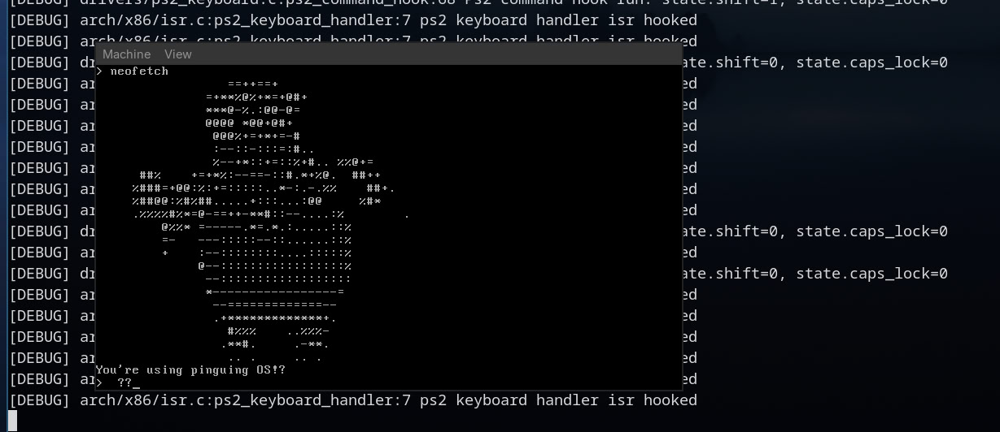

# Pinguin OS

Учебная операционная система. На данный момент ведется разработка :(

## Уже сделано

- Двух этапная загрузка legacy-BIOS
- Обработка прерываний
- gdt
- memory detection
- keyboard driver
- e9 logging
- vga driver
- kernel shell framework

## Процесс загрузки

- mbr ищет первый активный boot раздел, копируется на другой адресс и запускает vbr
- vbr читает bin файл загрузкичка второго уровня
- загрузчик второго уровня загружает gdt, активирует a20 и переходит в 32-protected mode
- загрузчик второго уровня получает всю параметры загрузки от BIOS и своих настроек (memory detection, boot drive, device detection e.t.c)
- загрузчик второго уровня парсит elf файл ядра и загружет его в соответсвии с заголовками
- ядро инициализирует interrupt descriptor table и переопределяет global descriptor table

## В разработке

- boddy page-frame allocator
- pagging
- virtual file system
- syscalls
- SLUB/SLOB/Slab allocator

## В планах

- Нормальный user-space
- user-space shell
- gui
- uefi bootloader
